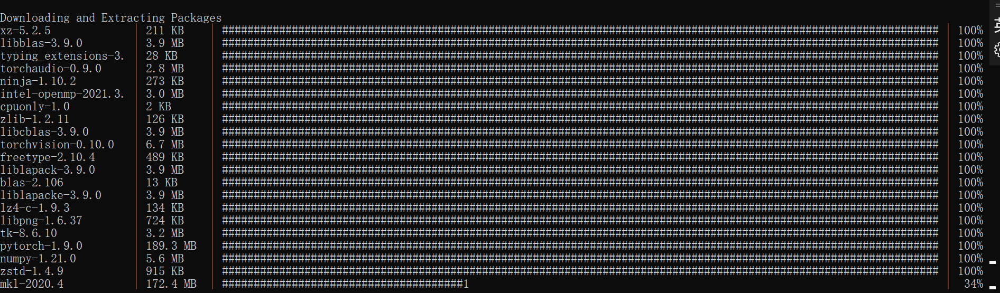

# Anaconda

Data: 2021-07-06

> 2021年7月6号第一次接触到Anaconda，因为要学OpenCV和Pytorch。一开始打算用pip来弄，但是找不到clashX和pip一起和谐相处的方法，所以打算换环境。
>
> 自己太菜了，整整安装了一个晚上。

## Cant Open Anaconda Navigator

### 报错

打开了一个html网页，告诉我错哪了。

```
Navigator Error
An unexpected error occurred on Navigator start-up

Report
Please report this issue in the anaconda issue tracker

Main Error
check_hostname requires server_hostname
```

### 原因

尚不清楚

### 解决

关闭clashX

## Solving environment: failed

无法创建虚拟环境

参考：[解决conda的“Solving environment: failed”问题](https://blog.csdn.net/weixin_43971405/article/details/101714371)

### 报错

```
Collecting package metadata (current_repodata.json): done
Solving environment: failed with current_repodata.json, will retry with next repodata source.
Collecting package metadata (repodata.json): done
Solving environment:
```

看到卡在那里就有不好的预感

### 原因

暂不清楚

### 解决

```conda
conda config --set channel_priority flexible
```

## Stuck at installing packages

有很多包要下载，下好了一个就卡在那里。

严格来说不是bug，但是很糟心。



### 原因

暂不清楚

### 解决

其实等着就好，总是可以安装完的，但是，有时候按回车，可以触发下一个包的下载。
